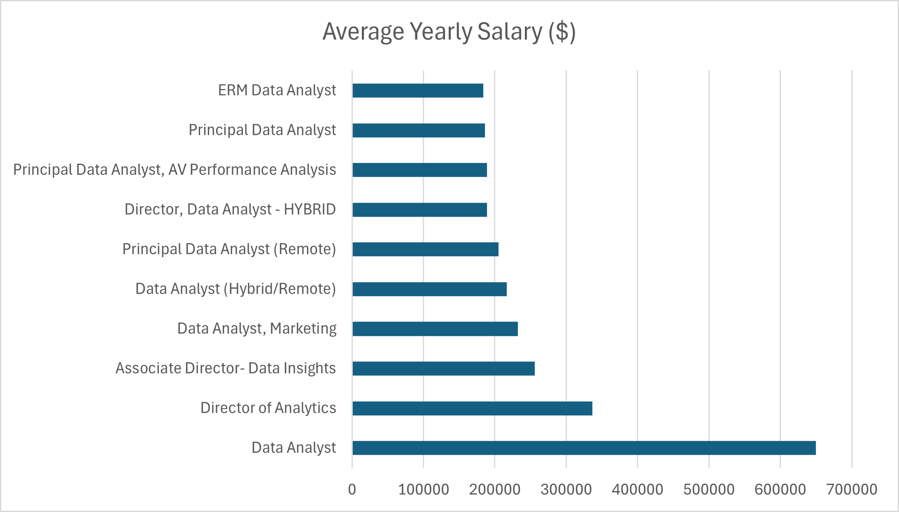
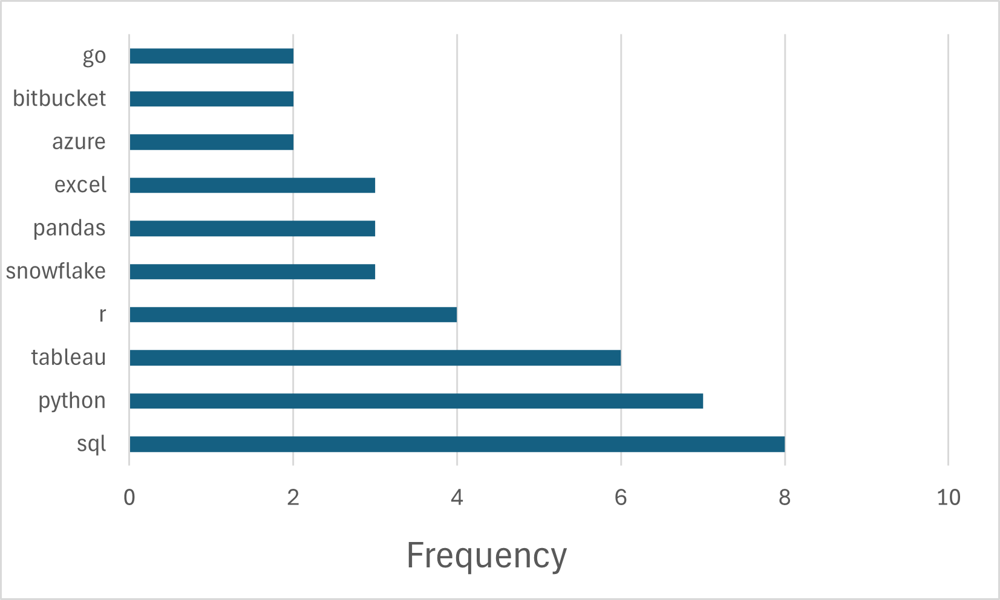

# Introduction
Dive into the data job market! Focusing on data analyst
roles, this project explores top-paying jobs, in-demand skills, and where high demand meets high salary in data analytics.

SQL queries? Check them out here: [project_sql folder](/project_sql/)
# Background
This project was part of a [SQL course](https://lukebarousse.com/sql). 
This project was born from a desire to pinpoint top-paid and in-demand skills, streamlining others work to find optimal jobs.

Data hails from the [SQL Course](https://lukebarousse.com/sql). It's packed with insights on job titles, salaries, locations, and essential skills.

### The questions i wanted to answer through my SQL queries were:
1. What are the top-paying data-analyst jobs?
2. What skills are required for these top-paying jobs?
3. What skills are most in demand for data analysts?
4. Which skills are associated with higher salaries?
5. What are the most optimal skills to learn?

# Tools Used
For the deep dive into the data analyst job market, I harnessed the power of several key tools:

- **SQL:** the backbone of my analysis, allowing me to query the database and unearth critical insights.
- **PostgreSQL:** The chosen database management system, ideal for handling the job posting data.
- **Visual Studio Code:** My go-to for database management and executing SQL queries.
- **Git & Github:** Essential for version control and sharing my SQL scripts and analysis, ensuring collaboration and project tracking.

# The Analysis
Each query for this project aimed at investigating specific aspects of the data analyst job market.

## 1. Top Paying Data Analyst Jobs
To identify the highest-paying roles, I filtered data analyst positions by average yearly salary and location, focusing on remote jobs. This query highlights the high paying opportunities in the field.

```sql
SELECT
    job_id,
    job_title,
    job_location,
    job_schedule_type,
    salary_year_avg,
    job_posted_date,
    name AS company_name
FROM
    job_postings_fact
LEFT JOIN company_dim ON job_postings_fact.company_id = company_dim.company_id
WHERE
    job_title_short = 'Data Analyst' AND
    job_location = 'Anywhere' AND
    salary_year_avg IS NOT NULL
ORDER BY
    salary_year_avg DESC
LIMIT 10;
```
Here's the breakdown of the top data analyst jobs in 2023:
- **Wide Salary Range:** Top 10 paying data analyst roles span from $184,000 to $650,000, indicating significant salary potential in the field.
- **Diverse Employers:** Shows a broad interest across different industries.
- **Job Title Variety:** Reflects varied roles and specializations within data analytics.


*Bar graph visualizing the salary for the top 10 salaries for data analysts; I used Excel to generate this graph from my SQL query results*

## 2. Skills for Top Paying Jobs
To understand what skills are required for the top-paying jobs, I joined the job postings with the skills data, providing insights into what employers value for high-compensation roles.

```sql
WITH top_paying_jobs AS (
    SELECT
        job_id,
        job_title,
        salary_year_avg,
        name AS company_name
    FROM
        job_postings_fact
    LEFT JOIN company_dim ON job_postings_fact.company_id = company_dim.company_id
    WHERE
        job_title_short = 'Data Analyst' AND
        job_location = 'Anywhere' AND
        salary_year_avg IS NOT NULL
    ORDER BY
        salary_year_avg DESC
    LIMIT 10
)

SELECT 
    top_paying_jobs.*,
    skills
FROM top_paying_jobs
INNER JOIN skills_job_dim ON top_paying_jobs.job_id = skills_job_dim.job_id
INNER JOIN skills_dim ON skills_job_dim.skill_id = skills_dim.skill_id
ORDER BY
    salary_year_avg DESC
```
Here's the breakdown of the most demanded skills for data analysts in 2023, based on job postings:
Here are the top 10 most common skills mentioned in the job postings for data analyst roles:

- SQL - 8 occurrences
- Python - 7 occurrences
- Tableau - 6 occurrences
- R - 4 occurrences
- Snowflake - 3 occurrences

This indicates that SQL and Python are the most sought-after skills, followed closely by Tableau,
with other tools and languages also being important but less frequently mentioned.


*Bar graph visualizing the count of skills most frequently requested in job postings. I used Excel to generate this graph from my SQL query result.*

## 3. Most In-Demand Skills for Data Analysts
This query helped identify the skills most frequently requested in job postings, directing focus to areas with high demand.

```sql
SELECT 
    skills,
    COUNT(skills_job_dim.job_id) AS demand_count
FROM job_postings_fact
INNER JOIN skills_job_dim ON job_postings_fact.job_id = skills_job_dim.job_id
INNER JOIN skills_dim ON skills_job_dim.skill_id = skills_dim.skill_id
WHERE
    job_title_short = 'Data Analyst'
GROUP BY
    skills
ORDER BY
    demand_count DESC
LIMIT 5;
```
Here's the breakdown of the most demanded skills for data analysts in 2023
- **SQL** and **Excel** remain fundamental, emphasizing the need for strong foundational skills in data processing and spreadsheet manipulation.
- **Programming** and **Visualization Tools** like **Python**, **Tableau**, and **Power BI** are essential, pointing towards the increasing importance of technical skills in data storytelling and decision support.

| Skills   | Demand Count |
|----------|--------------|
| sql      | 92628        |
| excel    | 67031        |
| python   | 57326        |
| tableau  | 46554        |
| power bi | 39468        |

*Table of the demand for the top 5 skills in data analyst job postings*

## 4. Skills based on Salary
Exploring the average salaries associated with different skills revealed which skills are the highest pating.
```sql
SELECT 
    skills,
    ROUND(AVG(salary_year_avg) , 0) AS avg_salary
FROM job_postings_fact
INNER JOIN skills_job_dim ON job_postings_fact.job_id = skills_job_dim.job_id
INNER JOIN skills_dim ON skills_job_dim.skill_id = skills_dim.skill_id
WHERE
    job_title_short = 'Data Analyst' AND
    salary_year_avg IS NOT NULL
GROUP BY
    skills
ORDER BY
    avg_salary DESC
LIMIT 25;
```
Here's a breakdown of the results for top paying skills for Data Analysts:

- **High Demand for Big Data & ML Skills:** Top salaries are commanded by analysts skilled in big data technologies (Pyspark, Couchbase), machine learning tools (DataRobot, Jupyter), and Python libraries (Pandas, NumPy), reflecting the industry's high valuation of data processing and predictive modelling capabilities.
- **Software Development & Deployment Proficiency:** Knowledge in development and deployment tools (Gitlab, Kubernetes, Airflow) indicates a lucrative crossover between data analysis and engineering, with a premium on skills that facilitate automation and efficient data pipeline management.
- **Cloud Computing Expertise:** Familiarity with cloud and data engineering tools (Elasticsearch, Databricks, GCP) underscores the growing importance of cloud-based analytics environments, suggesting that cloud proficiency boosts earning potential in data analytics. 

| Skills    | Average Salary ($) |
|-----------|---------------- |
| pyspark   | 208,172         |
| bitbucket | 189,155         |
| couchbase | 160,515         |
| watson    | 160,515         |
| datarobot | 155,486         |
| gitlab    | 154,500         |
| swift     | 153,750         |
| jupyter   | 152,777         |
| pandas    | 151,821         |

**Table of the average salary for the top 10 paying skills for data analysts**

## 5. Most Optimal Skills to Learn
Combining insights from demand and salary data, this query aimed to pinpoint skills that are both in high demand and have high salaries, offering a strategic focus for skill development.
```sql
SELECT
    skills_dim.skill_id,
    skills_dim.skills,
    COUNT(skills_job_dim.job_id) AS demand_count,
    ROUND(AVG(job_postings_fact.salary_year_avg), 0) AS avg_salary
FROM
    job_postings_fact
INNER JOIN skills_job_dim ON job_postings_fact.job_id = skills_job_dim.job_id
INNER JOIN skills_dim ON skills_job_dim.skill_id = skills_dim.skill_id
WHERE
    job_title_short = 'Data Analyst' AND
    salary_year_avg IS NOT NULL AND
    job_location = 'Anywhere'
GROUP BY
    skills_dim.skill_id
HAVING
    COUNT(skills_job_dim.job_id) > 10
ORDER BY
    demand_count DESC,
    avg_salary DESC
LIMIT 25;
```
| Skills      | Demand Count | Average Salary ($) |
|-------------|--------------|---------------- |
| sql         | 398          | 97,237          |
| excel       | 256          | 87,288          |
| python      | 236          | 101,397         |
| tableau     | 230          | 99,288          |
| r           | 148          | 100,499         |
| power bi    | 110          | 97,431          |
| sas         | 63           | 98,902          |
| powerpoint  | 58           | 88,701          |
| looker      | 49           | 103,795         |
| word        | 48           | 82,576          |
| snowflake   | 37           | 112,948         |
| oracle      | 37           | 104,534         |
| sql server  | 35           | 97,786          |
| azure       | 34           | 111,225         |
| aws         | 32           | 108,317         |
| sheets      | 32           | 86,088          |
| flow        | 28           | 97,200          |
| go          | 27           | 115,320         |

*Table of the most optimal skills for data analyst sorted by demand count*
Here's a breakdown of the most optimal skills for Data Analysts in 2023:
 
- **High-Demand Programming Languages:** Python ad R stand out for their high demand, with demand counts of 236 and 148 respectively. Despite their high demand, their average salaries are around $101,397 for Python and $100,499 for R, indicating that proficiency in these languages is highly valued but also widely available.
- **Cloud Tools and Technologies:** Skills in specialized technologies such as Snowflake, Azure, and AWS show significant demand with relatively high average salaries, pointing towards the growing importance of cloud platforms and big data technologies in data analysis.
- **Business Intelligence and Visualization Tools:** Tableau and Looker, with demand counts of 230 and 49 respectively, and average salaries around $99,288 and $103,795, highlight the critical role of data visualization and business intelligence in deriving actionable insights from data.
- **Database Technologies:** The demand for skills in traditional and NoSWL databases (Oracle, SQL Server, NoSQL) with average salaries ranging from $97,786 to $104,534, reflects the enduring need for data storage, retrieval, and management expertise.


# Learnings

Throughout this project, I've turbocharged my SQL toolkit with some serious firepower:
- **Advanced Query Development:** Demonstrated expertise in complex SQL operations, proficiently merging tables and utilizing WITH clauses to effectively manage temporary tables.
- **Data Aggregation:** Proficiently utilized GROUP BY along with aggregate functions such as COUNT() and AVG() to effectively summarize and analyze data.
- **Analytical Expertise:** Enhanced problem-solving capabilities by translating complex questions into actionable and insightful SQL queries.

# Conclusions
### Insights
From the analysis, several general insights emerged:

1. **Top-paying Data Analyst Jobs**: The highest-paying jobs for data analysts that allow remote work offer a wide range of salaries, the highest at $650,000!
2. **Skills for Top-Paying Jobs**: High-paying data analyst jobs require advanced proficiency in SQL, suggesting it's a critical skill for earning a top salary.
3. **Most In-Demand Skills**: SQL is also the most demanded skill in the data analyst job market, thus making it essential for job seekers.
4. **Skills with Higher Salaries**: Top salaries are commanded by analysts skilled in big data technologies (Pyspark, Couchbase), machine learning tools (DataRobot, Jupyter), and Python libraries (Pandas, NumPy), reflecting the industry's high valuation of data processing and predictive modelling capabilities.
5. **Optimal Skills for Job Market Value**: SQL leads in demand and offers a high average salary, positioning it as one of the most optimal skills for data analysts to learn to maximize their market value. 

### Closing Thoughts
This project enhances my SQL skills and provided valuable insights into the data analyst job market. The findings from the analysis serve as a guide prioritizing skill development ad job search efforts. Aspiring data analytics can better position themselves in a competitive job market by focusing on high-demand, high-salary skills. This exploration highlights the importance of continuous learning and adaptation to emerging trends in the field of data analytics.
